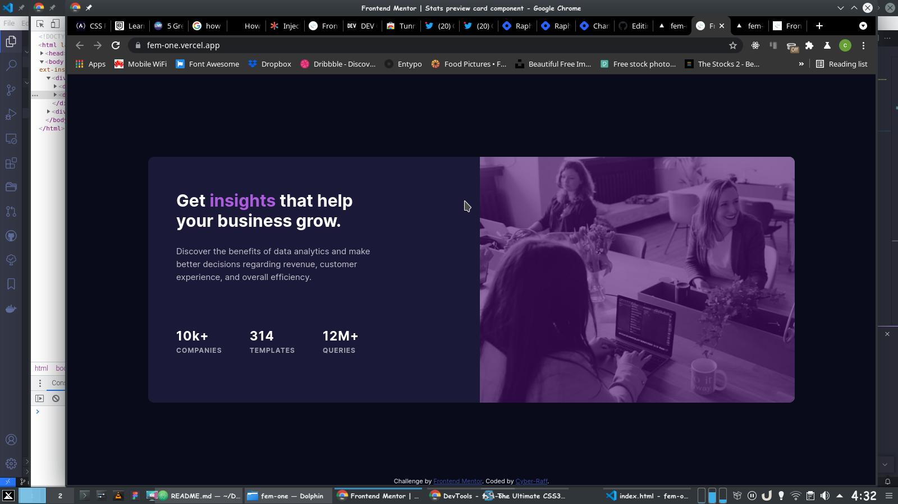

# Frontend Mentor - Stats preview card component solution

This is a solution to the [Stats preview card component challenge on Frontend Mentor](https://www.frontendmentor.io/challenges/stats-preview-card-component-8JqbgoU62). Frontend Mentor challenges help you improve your coding skills by building realistic projects. 

## Table of contents

- [Frontend Mentor - Stats preview card component solution](#frontend-mentor---stats-preview-card-component-solution)
  - [Table of contents](#table-of-contents)
  - [Overview](#overview)
    - [The challenge](#the-challenge)
    - [Screenshot](#screenshot)
    - [Links](#links)
  - [My process](#my-process)
    - [Built with](#built-with)
    - [What I learned](#what-i-learned)
    - [Continued development](#continued-development)
    - [Useful resources](#useful-resources)
  - [Author](#author)
  - [Acknowledgments](#acknowledgments)

## Overview

### The challenge
Building A Responsive Landing Page Using CSS FlexBox.

### Screenshot

### Links

- Solution URL: [Solution URL](https://github.com/cyberraff/fem-one)
- Live Site URL: [Live site URL](https://fem-one.vercel.app/)

## My process

### Built with

- Semantic HTML5 markup
- CSS custom properties
- Flexbox
- CSS Grid
- Mobile-first workflow

### What I learned

How to use FlexBox.
### Continued development

Use this section to outline areas that you want to continue focusing on in future projects. These could be concepts you're still not completely comfortable with or techniques you found useful that you want to refine and perfect.

### Useful resources

- [W3 school](https://www.w3schools.com/) - This helped me really understand FlexBox
- [Google](https://www.google.com/) - This helped me get answers I'd recommend it to anyone still learning.

## Author

- Website - [Cyber-Raff](https://twitter.com/CyberRaff)
- Frontend Mentor - [@cyberraff](https://www.frontendmentor.io/profile/cyberraff)
- Twitter - [@CyberRaff](https://twitter.com/CyberRaff)

## Acknowledgments

I am grateful to God to be opportune to do this.
